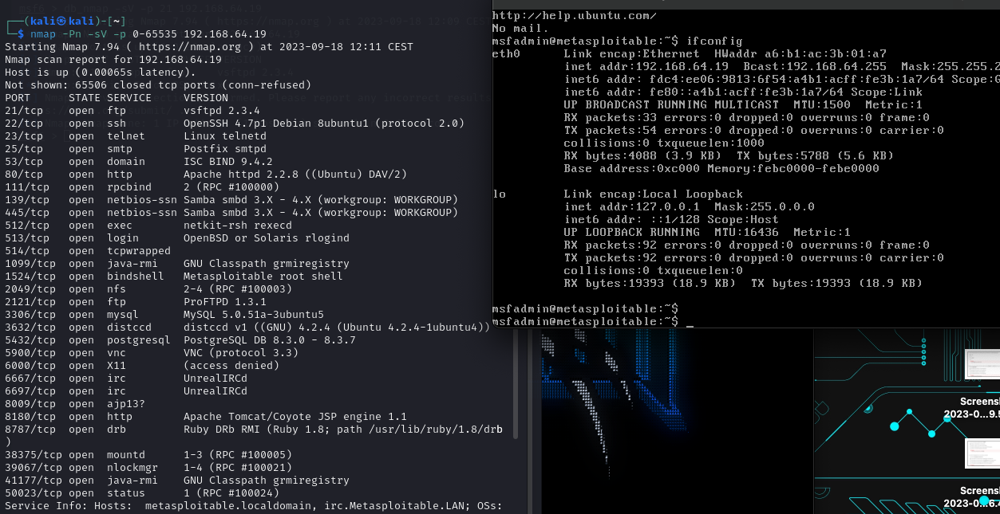
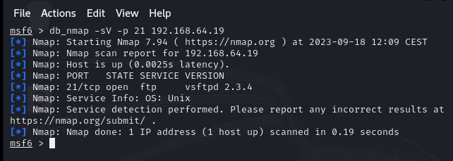
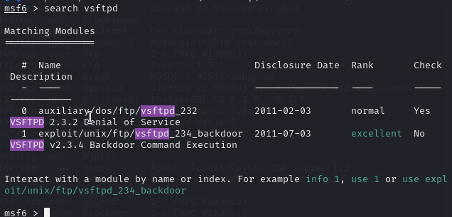
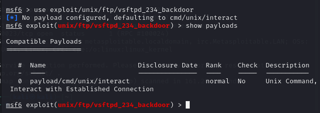
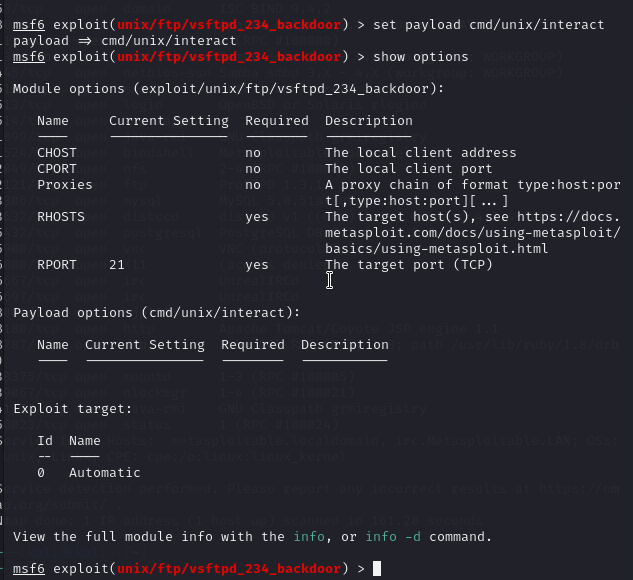
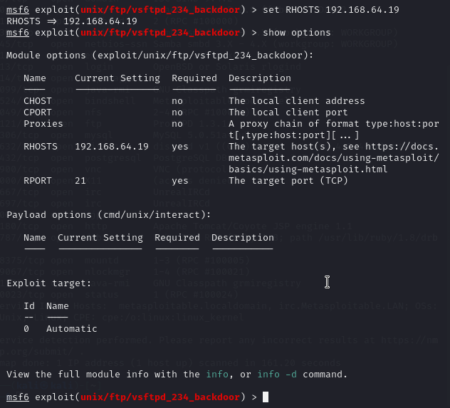
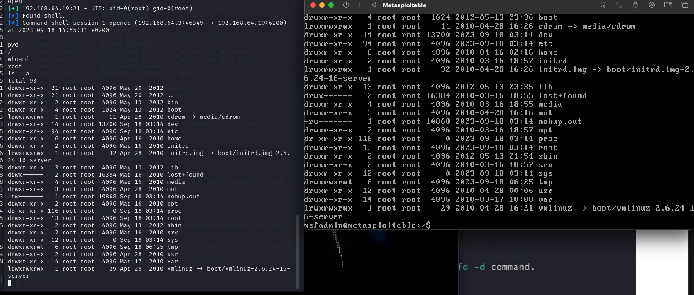
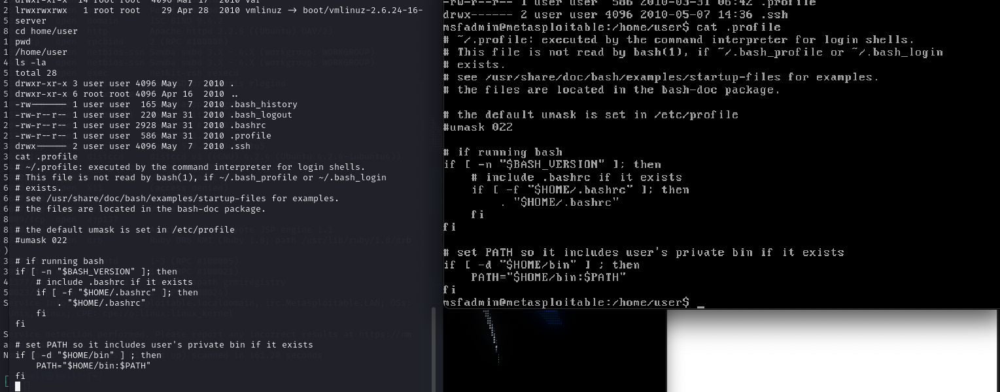

# Pentesting-Metasploit-Vulnerabilities  

Exploiting vulnerabilities in Metasploitable

## What I want to achieve?

I want to see if I’m able to search and find any vulnerability on a mestasploitable machine and exploit it.

## How I will achieve it?

In order to achieve this, I will follow some of the steps I’ve learned during my Master Degree studies, such as fingerpinting the metasploitable machine, scanning the network/ports.

<b>Procedure:</b>

I launched a port scanning using NMAP. The scanning was done from the Kali Linux machine to the IP of the metasploitable VM.
Below you will see on the left side the KALI machine and on the right the Metasploitable.

  

Here a detail of the report of the nmap scan.

```
Nmap scan report for 192.168.64.19
Host is up (0.00067s latency).
Not shown: 65506 closed tcp ports (conn-refused)
PORT      STATE SERVICE     VERSION
21/tcp    open  ftp         vsftpd 2.3.4
22/tcp    open  ssh         OpenSSH 4.7p1 Debian 8ubuntu1 (protocol 2.0)
23/tcp    open  telnet      Linux telnetd
25/tcp    open  smtp        Postfix smtpd
53/tcp    open  domain      ISC BIND 9.4.2
80/tcp    open  http        Apache httpd 2.2.8 ((Ubuntu) DAV/2)
111/tcp   open  rpcbind     2 (RPC #100000)
139/tcp   open  netbios-ssn Samba smbd 3.X - 4.X (workgroup: WORKGROUP)
445/tcp   open  netbios-ssn Samba smbd 3.X - 4.X (workgroup: WORKGROUP)
512/tcp   open  exec        netkit-rsh rexecd
513/tcp   open  login       OpenBSD or Solaris rlogind
514/tcp   open  tcpwrapped
1099/tcp  open  java-rmi    GNU Classpath grmiregistry
1524/tcp  open  bindshell   Metasploitable root shell
2049/tcp  open  nfs         2-4 (RPC #100003)
2121/tcp  open  ftp         ProFTPD 1.3.1
3306/tcp  open  mysql       MySQL 5.0.51a-3ubuntu5
3632/tcp  open  distccd     distccd v1 ((GNU) 4.2.4 (Ubuntu 4.2.4-1ubuntu4))
5432/tcp  open  postgresql  PostgreSQL DB 8.3.0 - 8.3.7
5900/tcp  open  vnc         VNC (protocol 3.3)
6000/tcp  open  X11         (access denied)
6667/tcp  open  irc         UnrealIRCd
6697/tcp  open  irc         UnrealIRCd
8009/tcp  open  ajp13?
8180/tcp  open  http        Apache Tomcat/Coyote JSP engine 1.1
8787/tcp  open  drb         Ruby DRb RMI (Ruby 1.8; path /usr/lib/ruby/1.8/drb)
38375/tcp open  mountd      1-3 (RPC #100005)
39067/tcp open  nlockmgr    1-4 (RPC #100021)
41177/tcp open  java-rmi    GNU Classpath grmiregistry
50023/tcp open  status      1 (RPC #100024)
```

I see following opened port (21), that can be interesting:
```
PORT      STATE SERVICE     VERSION
21/tcp    open  ftp         vsftpd 2.3.4
```
Double checking with Metasploit:

  

Confirmed that `port 21` is open. It’s a FTP service with the following version: `VSFTPD 2.3.4`
Let’s see if there are any vulnerabilities related. Making a quick search in Metasploit I can find a backdoor.

  

Checking in [CVEDETAILS](https://www.cvedetails.com/cve/CVE-2011-2523/) I can see more information.

  

This vulnerability opens a shell on `port 6200/tcp`.
Let’s try to exploit this :eyes:.

I will use the exploit that I saw earlier: 
```
exploit/unix/ftp/vsftpd_234_backdoor
```
Now let's see the related payloads.

  

After setting the payload I check the available options.

  

Remote Port (RPORT) is already set to the one I’m interesting in: `21`
Now let’s config the remote host (RHOSTS).

  

Final step … exploit the machine :smiling_imp:.

  

As shown on the terminal, a SHELL has been found, seems to be a SUCCESS!!
Let’s see if I can check anything from the attacked machine using the remote shell. I will start by typing some simple commands like: `pwd`, `whoami` and `list` some folder content.

On the left side it shows the output on the Kali machine while on the right the terminal output of the metasploitable machine.

  

```
pwd: show that I’m at root directory

whoami: show that I’m root

ls -la: show the files and folders that are visible on the root directory
```

Will try to navigate to some folder and get more information.

  

You see I can navigate to folder `home/user` and read a file with cat command.

I would say the exploitation was a :tada:SUCCESS!!:tada:
